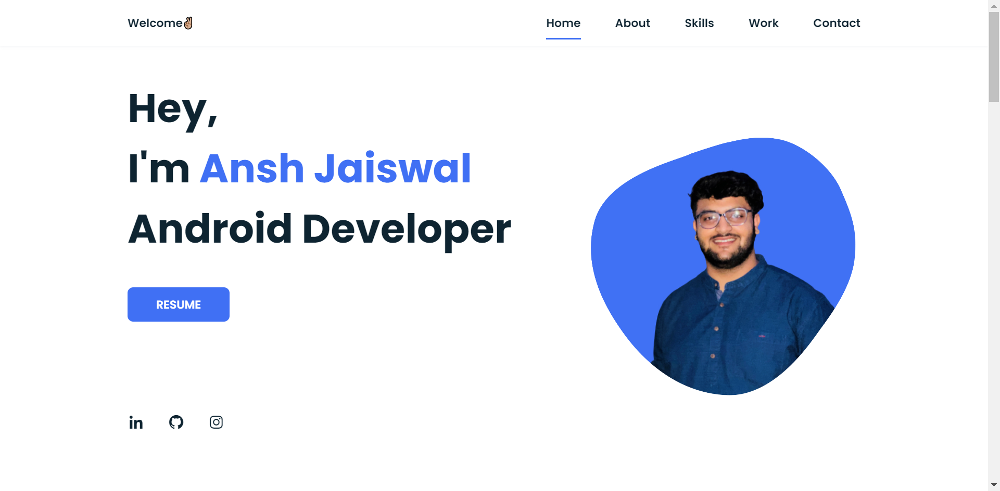

<a target="_blank" rel="noopener noreferrer" href="https://anshjaiswal.netlify.app/"><h1 align="center">Ansh Jaiswal | Portfolio</h1></a>

 <h2 align="center">My portfolio as an Android Developer using HTML, CSS & Javascript</h2>
 
 
 

    

<!-- Footer -->
 

<!-- Footer END -->

## :wrench: Setup

`git clone https://github.com/anshjaiswal31/Portfolio`

Download and run

`index.html`
